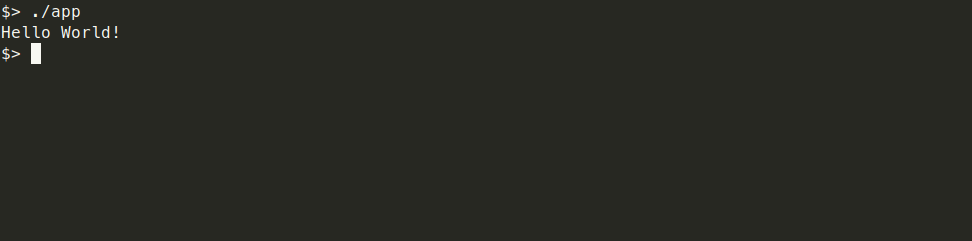

<h1 align="center">Hello World</h1>
<p align="center">Output the string "Hello World!" on Standard Output.</p>
<div align="center">
  
  
  
  
</div>

## :sparkles: Demo



## :memo: Requirements

If you want to build the project you will need:
- [Gradle](https://gradle.org/);
- Java Development Kit ([JDK](https://openjdk.org/));
- unzip or tar;

If you want just to run the project, you will need:
- Java Runtime Environment ([JRE](https://www.java.com/pt-BR/download/manual.jsp));
- unzip or tar;

## :computer: Installation

You have two choices: [Get the Release](#get-the-release) or [Build Yourself](#building-yourself).

### Get the Release

[Click here to get the latest release](https://github.com/soyowendy/hello-world/releases/latest) and install `app.tar` or `app.zip`, and follow to [Usage section](#rocket-usage).

### Building Yourself

First you need to clone the project with:

```bash
git clone https://github.com/soyowendy/hello-world # Clone repository
cd hello-world # Enter in the folder
./gradlew build # Build with Gradle
```

Your build is in the following path: `app/build/distributions`.

```bash
cd app/build/distributions
```

Now, follow to to [Usage section](#rocket-usage).


## :rocket: Usage

To run the project, first unzip the package:

```bash
unzip app.zip
```

or 

```bash
tar xvf app.tar
```

Now, the executable the path to executable is: `./app/bin`.

- `app` file is for Linux/BSD/MacOS
- `app.bat` file is for Windows/MS-DOS

To execute, run the following commands:

```bash
./app/bin/app
```

or

```bash
cd app/bin
./app
```

## :technologist: Contributing
Pull requests are welcome. For major changes, please open an issue first to discuss what you would like to change.

Please make sure to update tests as appropriate.

## :scroll: License
[WTFPL](LICENSE)
